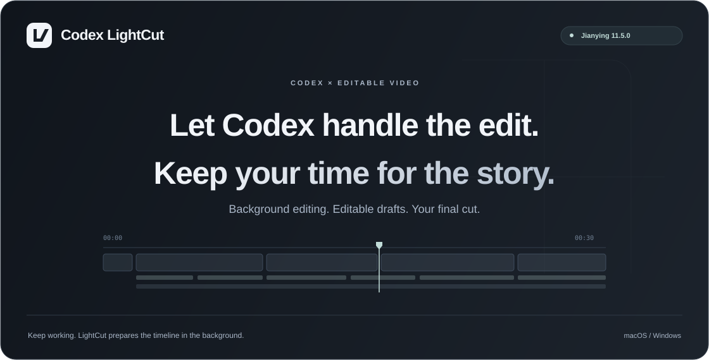

<a href="https://github.com/wangzhezbz/codex-lightcut/raw/refs/heads/main/downloads/LightCut-Mac-Windows-R84.zip">Download for macOS</a> · <a href="https://github.com/wangzhezbz/codex-lightcut/raw/refs/heads/main/downloads/LightCut-Mac-Windows-R84.zip">Download for Windows</a>

<a href="README.md">简体中文</a> · <strong>English</strong>

## Edit through conversation

LightCut helps Codex turn talking-head footage into an editable Jianying draft, with separate video, caption and music tracks.

## Get started

1. Download and extract the package.
2. Open the `codex-lightcut` folder in Codex and ask: “Install LightCut and prepare local transcription.”
3. Attach a video and ask: “Edit this with LightCut, remove repetition and long pauses, add single-line captions, and give me an editable Jianying draft.”
4. Choose your cover, effects, music and pacing. Open the resulting draft in Jianying to review and export.

The package includes both draft engines. Codex selects the platform and prepares dependencies; first-time installation needs internet access. Install Jianying separately.

## Your preferences

Use your own cover, extract a frame, generate a cover or omit it. Generated covers offer five starting styles and are shown for approval. Effects can be enabled, disabled or adjusted individually. Provide music you have permission to use, or choose none. Caption styling, speed and ending fade are adjustable. Save choices as defaults only when you want to.

## Versions

- LightCut **R8.4 / 0.4.4-preview.1**.
- Jianying Pro **11.5.0** on Apple Silicon macOS or x64 Windows.
- Windows build **11.5.0.14471**.
- Compatibility will follow future Jianying releases after verification.

## Usage notes

Editing runs in the background without launching or closing Jianying or taking keyboard focus. If Jianying is running, draft registration waits for a normal exit. Existing drafts are preserved. Review the result before export; paid effect entitlements remain governed by Jianying. LightCut is used through Codex, not a standalone editor window.
