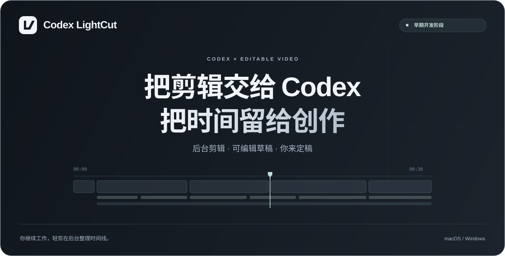

<p align="center">
  
</p>

<p align="center">
  <a href="https://github.com/wangzhezbz/codex-lightcut/raw/refs/heads/main/downloads/LightCut-Mac-Windows-R82.zip"></a>
  <a href="https://github.com/wangzhezbz/codex-lightcut/raw/refs/heads/main/downloads/LightCut-Mac-Windows-R82.zip"></a>
</p>

<p align="center">
  <strong>简体中文</strong> · <a href="README.en.md">English</a>
</p>
<p align="center">
  <a href="docs/getting-started.md">从这里开始</a> ·
  <a href="docs/capabilities.md">功能与边界</a> ·
  <a href="docs/roadmap.md">开发路线</a> ·
  <a href="CHANGELOG.md">更新记录</a> ·
  <a href="docs/licensing.md">许可说明</a>
</p>

## 下载 R8.2 集成运行包

[下载 Mac / Windows 完整插件包](downloads/LightCut-Mac-Windows-R82.zip) · **0.4.2-preview.1**

包含LightCut运行源码、两端草稿引擎、安装器和校验工具。用户无需另找引擎，解压后交给Codex按[安装说明](docs/release-r82.md)操作即可。剪映专业版需自行安装，Python、FFmpeg和可选语音模型由安装器准备。

当前适配 **剪映专业版11.5.0**，Windows已验收构建 **11.5.0.14471**。后续随剪映更新持续适配，验证后再支持新版本。R8.2集成包已通过Mac环境检查，Windows新打包方式仍待实机安装回归；R8.1剪辑和字幕接缝验收保留。

## 让 Codex 帮你完成剪辑初稿

**Codex LightCut · Codex 轻剪**，面向 macOS 与 Windows 的后台视频剪辑项目。目标是让 Codex 根据素材和要求处理剪切、字幕、封面与声音，交付可以在剪映继续调整的草稿。

视频、字幕和音乐保留独立轨道。制作过程不主动打开剪映、不模拟键鼠；草稿登记遇到编辑器运行时等待自然退出。你可以继续工作，在方便时打开草稿检查和精修。


## 当前支持版本

**当前适配剪映专业版 11.5.0（macOS / Windows）；Windows 已验收构建为 11.5.0.14471。** 后续跟随剪映版本更新持续适配，新版本完成兼容验证后再纳入支持范围。升级剪映前请先查看[平台兼容性](docs/platforms.md)，不能将相同主版本号视为所有组件均兼容。

## 一条素材，到可继续编辑的草稿

```text
素材 + 剪辑要求
      ↓
Codex 分析内容，形成剪辑计划
      ↓
后台处理素材、字幕、封面与声音
      ↓
校验素材、时间线及固定参数
      ↓
生成草稿 → 等待可登记时机 → 你打开并精修
```

内容取舍和气口判断目前仍有 Agent 分析与人工复核环节。自动质检能发现参数和文件问题，不能替代实际画面与听感验收。

## 已经做到哪一步

| 能力 | 本地研究版本 | 公开交付状态 |
| :--- | :--- | :--- |
| 可编辑时间线 | 多轨、剪切、普通变速、字幕与素材引用 | 工程格式与开发说明整理中 |
| macOS 草稿 | 匹配的剪映 11.5.0 本机环境已交付真实口播草稿 | 尚无通用安装包 |
| Windows 草稿 | 指定环境构建、回读、登记及样片查看已通过 | 保存重开与更多版本仍需独立验收 |
| 美颜、滤镜、调色 | Mac/Windows 指定资源已适配，既有样片得到用户确认 | 不覆盖所有效果、权益与版本 |
| 字幕与声音 | 单行字幕参数、固定字幕位置、人声与 BGM 独立音量校验 | 不代表所有画布与版本均已验证 |
| 封面 | 已在真实项目中使用新生成封面与首帧封面 | 自动生图流程尚未作为独立功能发布 |
| 气口处理 | 已做波形对比和局部精修 | 词级强制对齐与稳定听感仍需完善 |
| 后台队列与缓存 | 本地已实现；登记时等待编辑器自然退出 | 资源占用与完整耗时继续测试 |

完整矩阵见 [功能与边界](docs/capabilities.md)。**“后台”不等于不消耗资源，“代码测试通过”不等于两端原生播放通过。**

## 怎么开始

- **想了解或试用**：先看 [使用与试用说明](docs/getting-started.md)，以及 [平台兼容性](docs/platforms.md)。现有公开预览包，安装器自动选择包内匹配引擎。
- **愿意协助 Windows 测试**：看 [验收步骤](docs/testing.md)，通过 Issue 提供脱敏后的环境信息。
- **想参与开发**：阅读 [协作指南](CONTRIBUTING.md) 和 [架构说明](docs/architecture.md)。
- **只想看展示页面**：本仓库根目录的 `index.html` 可离线打开；它是产品介绍页，不是剪辑客户端。

## 当前验证记录

截至 **2026-09-24**，R8.1 Windows 回传包含 44 项通过的安装、封面、字幕映射与质检测试。真实口播样片完成原生回读、登记，并由用户确认接缝字幕没有问题。R8 升级及独立封面尺寸迁移也已通过。

这些是指定测试环境的结果，不是所有电脑通用兼容保证。自动映射不会纠正粗 ASR 的错误时间；实际字词仍须复核。完整记录见 [R8.1 验收与交付状态](docs/release-r81.md)。

性能会分别记录首次准备、转写、素材处理、草稿构建和验收耗时；在完成基准前，不承诺“所有视频几秒剪完”。

## 来源、许可与关系

产品安装和使用统一呈现为 Codex LightCut。依赖授权与必要声明集中在[许可说明](docs/licensing.md)，不作为日常操作步骤。

本仓库原创展示页面、文档及检查脚本使用 [MIT 许可](LICENSE)。MIT 不扩展到未包含的第三方引擎、剪映程序、字体、音乐或效果资源，详见 [许可范围](docs/licensing.md)。

这是独立社区项目，与 OpenAI、剪映及其他同名产品不存在官方隶属关系。名称中的 Codex 表示预期协作方式，不代表官方出品。
