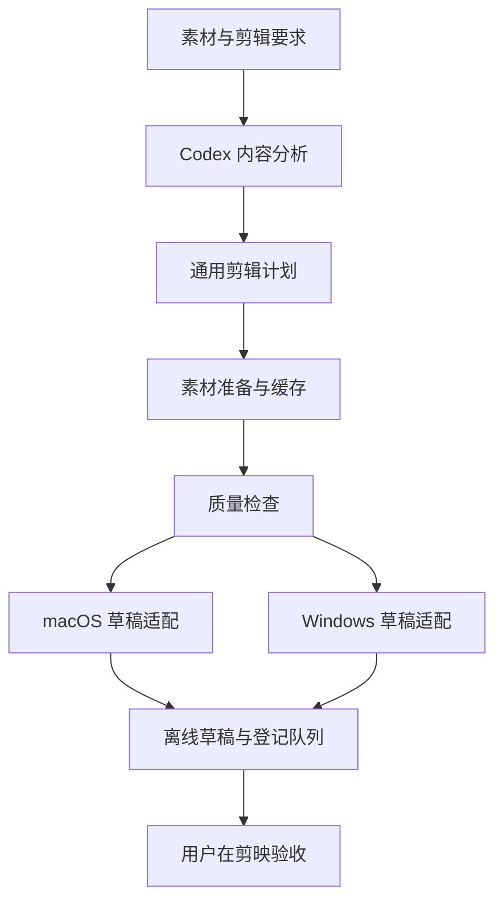

# 架构说明

[返回首页](../README.md)

本项目的目标是用一份通用剪辑计划衔接内容分析与平台草稿。下图描述本地研究设计；本公开仓库目前只发布介绍与文档。

## 通用计划

保存画布、素材引用、时间范围、轨道、字幕与明确参数。素材相对路径及内容摘要支持迁移和完整性检查；平台专有资源与账号授权不混进可迁移的公共层。

## 平台适配

根据平台和已验证的应用身份生成原生结构。遇到不支持的参数或效果时显式报错。Mac 已用本机环境交付；Windows 候选独立维护，不能用 Mac 的效果缓存替代 Windows 资源。

## 队列与复用

媒体处理与登记分开：先在独立目录构建和检查，再等待编辑器自然退出后登记。缓存按素材、处理配方与工具版本识别，复用前检查内容。失败时保留日志，不自动覆盖已有工程。

## 公开仓库与本地研究

公开运行包包含插件源码和两端草稿引擎，独立依赖保留各自许可。剪映应用、用户素材、效果缓存与凭证不随包分发。
